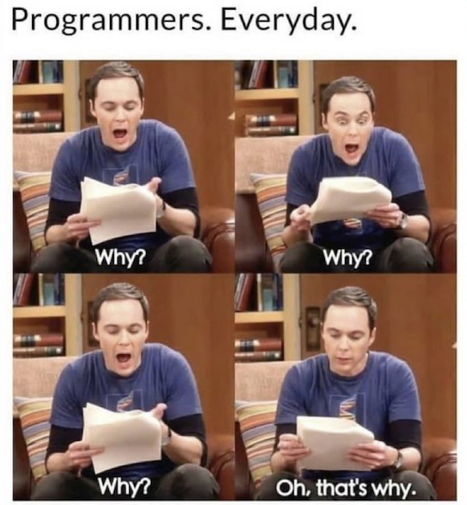

# php-debugging

---
### MaTS

---
## About
Debugging is the pinpoint to being a master in any coding language.
Everyone gets errors, but the best programmers never let it stop them and they find a way to fix it every time! I scoured the internet for a debugging guide, that I felt like I could get behind and here it is: [The guide](https://rollbar.com/guides/php/how-to-debug-php-errors/)

This is what I feel like doing when coding PHP that doesn't mean that this should be your way. Discover, look up, research whatever ways work for you to debug you code!

I very much encourage you to use xDebug as much as possible!

---
## Learning objectives
- understanding the root of bug fixing
- know what print_r, var_dump, die, echo, exit, break do
- know what to do the next time you're stuck
- give yourself the solver's mentality, a problem is just an opportunity to learn!
---
## The mission
Open up the junior.php.broken file, read the comments, fix the code blocks as requested in the comments and put the final file expert.php in the repository folder as requested.

You will change this junior code in expert code!

---
## What were the problems?

- ex 1
  - missing parameter in function
- ex 2
  - array started at [1] instead of [0], needed to change the index
- ex 3
  - the wrong quotation marks were used
    - “...“ was used instead instead of "..."
    - added '' wrapping first string to take "" in the string
  - Also changed the string length to make sure it was the right size and fitted " " in there after changes
- ex 4
  - added & in foreach loop parameter -> 
    - link: https://www.php.net/manual/en/control-structures.foreach.php
- ex 5
  - changed comparison Operator from <= to !=
    - <= means: less than or equal to
      - example: $a <= $b - Less than or equal to - true if $a is less than or equal to $b.
    - != means: not equal
      - example: $a != $b - Not equal - true if $a is not equal to $b after type juggling.
  - changed "z" to "aa" so "z" is still included and so the loops stops at "aa"
- ex 6
  - add & -> see exercise 4
  - switch parameter en separator place in the return
    - right syntax, otherwise fatal error
  - count($heroes)"-1"
    - 2 arrays nested in heroes, count($heroes) = 2, so randomizer can ask for index 2, which doesn't exist 
  - changed echo to return
    - so the value $randname can be reused in the echo
- ex 7
  - changed the integer to a string
    - the return is a strong and not an integer
  - changed return to echo, so it is displayed on the page
- ex 8
  - changed "||" to "&&" 
    - This makes it, so it's "and" instead of "or"
  - changed the first return in the if statement to echo
    - 2 returns don't work in if statement
  - added breaks so it is visually more pleasing
- ex 9
  - if statement becomes ">-1" instead of "== true"
    - .
  - first return becomes echo
    - so it shows on the page
  - beneath echo putted return so function stops
  - return acceptable becomes echo acceptable
    - so it shows on page
- ex 10
  - added +1 to "count($areTheseFruits)" in the for loop
    - because the array length gets updated while removing data from it and "car" wouldn't get checked if it's a fruit, because the element "car" w

### Useful resources 

- https://rollbar.com/guides/php/how-to-debug-php-errors/
- https://www.php.net/manual/en/
